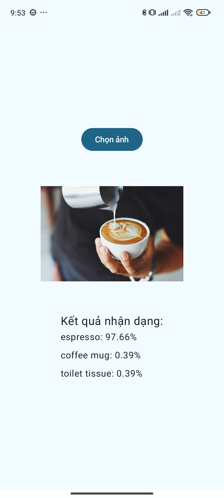

# TensorFlow Lite Image Classifier Demo

Ứng dụng Android demo nhận dạng ảnh sử dụng TensorFlow Lite và Jetpack Compose

    

## 🚀 Tính năng chính
- **Chọn ảnh** từ thư viện thiết bị
- **Hiển thị ảnh** với tỷ lệ phù hợp
- **Phân loại vật thể** trong ảnh thời gian thực
- **Hiển thị top 3 kết quả** với độ tin cậy
- Xử lý lỗi khi:
    - Load model thất bại
    - Phân tích ảnh lỗi
    - Ảnh không hợp lệ
- Giao diện Material Design 3 đơn giản

## 🛠 Công nghệ sử dụng

- **Jetpack Compose** - Xây dựng giao diện người dùng hiện đại theo phong cách declarative
- **TensorFlow Lite** - Machine learning library để chạy model trên thiết bị di động
- **mobilenet_v1_1.0_224_quantized_1_metadata_1.tflite** - Model phân loại ảnh
- **Coil** - Tải và hiển thị ảnh
